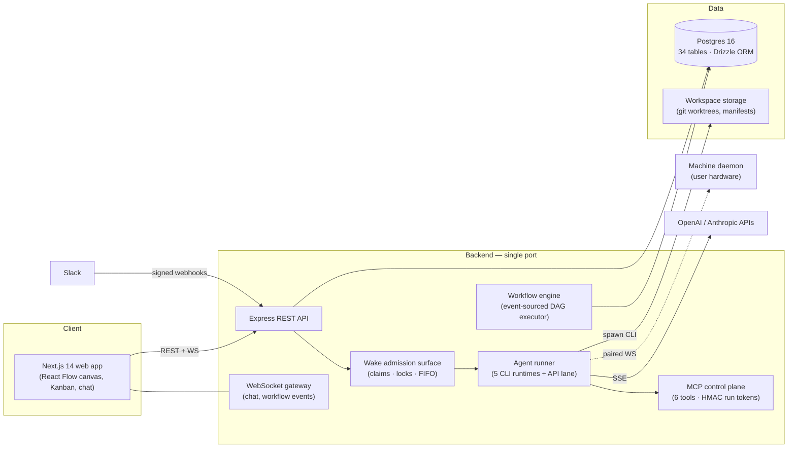

# Loxo

**An operations platform for AI employee teams** — the loxodrome for your AI crew: a constant bearing through the chaos of multi-agent work. Run a roster of persistent AI agents the way you'd run a real team: set goals, assign issues, watch execution live, review the work, and let every cycle make the next one better — with a human holding final authority at every step.

```
Goal ──> Issue ──> Assign (wake) ──> Run ──> Review ──> Distill ──> better next Run
                        ▲                                  │
                        └───────── rejection re-wakes ─────┘
```

Loxo is not another agent runtime. Runtimes do the work; Loxo keeps continuous, multi-agent work **from spiraling out of control** — every task has an owner, an audit trail, a review gate, and a cost line.

*TypeScript end to end · Express + Postgres backend · Next.js 14 frontend · 480 tests, all green.*


---

## What makes it interesting

### One control plane, six execution lanes

Agents bind to any of **five CLI coding runtimes** — Claude Code, Codex, OpenCode, Hermes, OpenClaw — or run as **API agents** speaking OpenAI Chat Completions or Anthropic Messages (SSE), all behind a single turn dispatcher. Runtime detection is fingerprint-based (`.claude/` vs `.codex/` markers with confidence scoring), and per-runtime capability differences are absorbed entirely in the adapter layer.

The two lanes are deliberate: **CLI agents** do heavy work that changes the world (code, files, commands); **API agents** do desk work (triage, drafting, summarization) through a thin in-process tool loop. Same agent model, same governance, different execution weight.

### Agents don't get trusted — they get audited

The platform's core stance: **agent-authored summaries are never treated as proof.** Evidence is collected by the system.

- **Isolated git workspaces** — each issue's code work happens in its own git worktree on its own branch. After every run (success, failure, or cancellation alike) the platform captures the diff, patch file, and a change fingerprint. Evidence capture cannot be skipped, and a capture failure never masks the run result.
- **Permission ceilings** — every agent has a workspace access tier (read-only / edit / full), enforced at run time. Review turns are always forced to read-only regardless of tier. If a read-only run still touches tracked files, git catches it and the violation is posted to the issue timeline as a visible policy breach.
- **Snapshot-pinned approvals** — a review approval is bound to the exact captured change snapshot it looked at. If the workspace drifts afterward, the approval is stale; merges validate against the approved snapshot, so a sign-off can never ship code it didn't see.

### Asymmetric review authority

Reviewer agents can **reject** — which reopens the issue and re-wakes the assignee with the feedback — but an **approval only recommends**: closing an issue stays a human decision. A three-cycle fuse breaks agent-to-agent rework loops: after three automated rejections the exchange halts and escalates to a human reviewer.

### Concurrency treated as a real distributed-systems problem

Agents are concurrent OS processes, so the platform handles the classic failure modes explicitly rather than by convention:

- **Single admission surface** — every wake trigger (issue assignment, chat mention, manual, review rejection) funnels through one entry point that merges duplicate triggers, atomically claims the agent, and locks the issue — or queues the request FIFO for later promotion.
- **Atomic cross-surface claims** — chat turns and issue runs share one agent claim via a conditional `UPDATE … RETURNING`, so an agent never executes two turns at once across surfaces. Chat busy? The run queues. Run busy? Chat reports it. Turn ends? The next queued run is promoted.
- **Per-issue execution locks live in the schema**, not in application convention — the same issue can never run twice concurrently.

### An MCP control plane with self-expiring credentials

Woken agents call back into the platform through a six-tool **MCP server** (`get_issue`, `comment_on_issue`, `update_issue_status`, `submit_review`, `ask_blocker`, `submit_result`). Each run is issued a **stateless HMAC-signed run token**: nothing is stored, nothing needs revoking — the token is valid exactly as long as the run is alive, collapsing credential revocation into a state lookup. Prompt injection with output parsing exists only as a fallback for runtimes without MCP support.

### A learning loop with a human gate

Run retrospectives are distilled into agent-, team-, and project-scoped memos and re-injected into later prompts — under hard caps (four memos per scope, 300 characters each) to guard against context rot. Distillation is automatic; promotion into an agent's working memory is human-reviewed. Agent behavior never changes silently.

### Workflow automations, event-sourced

Repeatable work compiles into a validated workflow DSL executed by a deterministic DAG engine: expected-edge joins, conditional branches, skip propagation, bounded loops, and concurrency caps. Execution state is **event-sourced in Postgres** — interrupted executions recover on restart instead of being lost. Workflows can be drawn on a visual canvas (React Flow, bidirectional DSL ⟷ canvas conversion with auto-layout) or generated from natural language with deterministic normalize-and-repair passes and thirteen structural validation rules behind the LLM.

### Run anywhere, govern in one place

A lightweight **machine daemon** pairs a user's own computer to the platform over a reconnecting WebSocket (pairing codes, machine tokens, allowed-workdir fencing, exponential backoff), so agents can execute on hardware you control while the control plane stays centralized.

---

## Feature tour

| Surface | What it does |
|---|---|
| **Dashboard** | Live operations view: open issues, active runs, busy agents, today's spend, a needs-attention triage panel, and an activity feed. |
| **Issue board** | Kanban with a full server-side state machine; the client mirrors legal transitions to dim invalid drop targets, and drag ordering uses fractional midpoints so a move is one `PATCH`, never a renumber. |
| **Chat** | One thread per agent, WebSocket-backed. Any conversation topic converts to an issue in one click — the LLM drafts it, you edit, the thread keeps a linked receipt. |
| **Agents** | Persistent employees with runtime bindings, provider credentials, skills, three-scope memory, and per-agent Slack integration. |
| **Runs** | Every wake-up produces a run: full transcript, status, token usage, and cost — bidirectionally traceable with its issue. |
| **Workshop** | Multi-agent discussion room with a deterministic speaker scorer (role relevance, topic match, silence decay), turn caps, and stop phrases — group deliberation without runaway API spend. Discussions deposit into a shared whiteboard that compiles into versioned workflow drafts. |
| **Projects & goals** | Projects group issues, workspaces, and automations; a hierarchical goal tree gives issues a "why" axis independent of the "where" axis. |
| **Marketplace** | Publish and adopt packaged agents, API-agent presets, and team templates. Publishing sanitizes workspaces — sensitive paths omitted, secrets (API keys, private keys, JWTs) redacted — and the same secret scan runs client-side before upload so credentials never leave the browser unnoticed. |
| **Slack** | Route Slack messages to agents and teams: HMAC signature verification with constant-time comparison, a five-minute replay window, and event-id deduplication. |


---

## Architecture



- **Single port** serves REST and WebSocket via HTTP upgrade.
- **Postgres 16 + Drizzle ORM** with migration history; join tables over JSON columns for relations; execution locks and review state live in the schema.
- **Security posture:** provider API keys and IM secrets encrypted at rest with AES-256-GCM; the server refuses to start without `JWT_SECRET` (fail-closed); Slack webhook paths are derived from the master key so forged URLs die without a database lookup; path-safety checks fence all workspace file access.
- **Monorepo:** `backend/` (Express API, ~20 domain modules), `frontend/` (Next.js App Router, 22 routes, one deliberate Zustand store), `daemon/` (headless machine agent), `packages/shared` (protocol and runner types shared by all three).

---

## Getting started

Prerequisites: Node 20+, Docker.

```bash
# 1. Postgres (host port 5434)
docker compose up -d

# 2. Backend — REST + WebSocket on :4000
cd backend
cp .env.example .env   # set JWT_SECRET and SECRETS_KEY (generation command inside)
npm install
npm run db:migrate
npm run dev

# 3. Frontend — http://localhost:3000
cd ../frontend
cp .env.example .env
npm install
npm run dev
```

Optional — let agents execute on your own machine:

```bash
cd daemon && npm install && npm run dev   # prints a pairing code
# approve it under Settings → Machines in the web UI
```

## Testing

```bash
cd backend && npm test    # 467 tests — API, engine, governance, integrations (vitest + supertest)
cd daemon  && npm test    # 13 tests — turn relay, workdir fencing
```

The suite covers the wake admission surface and cross-surface claims, workspace capture and permission enforcement, review pinning, the workflow executor (including join/race regressions), Slack signature verification, and marketplace publish sanitization.

## Repository layout

```
backend/    Express + TypeScript API, WebSocket gateway, agent runner, workflow engine
frontend/   Next.js 14 web app (App Router, Tailwind, React Flow, Zustand)
daemon/     Headless daemon that pairs a user machine to the platform
packages/   Shared protocol and type definitions
```
