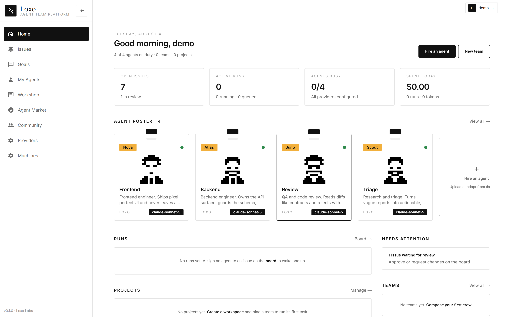
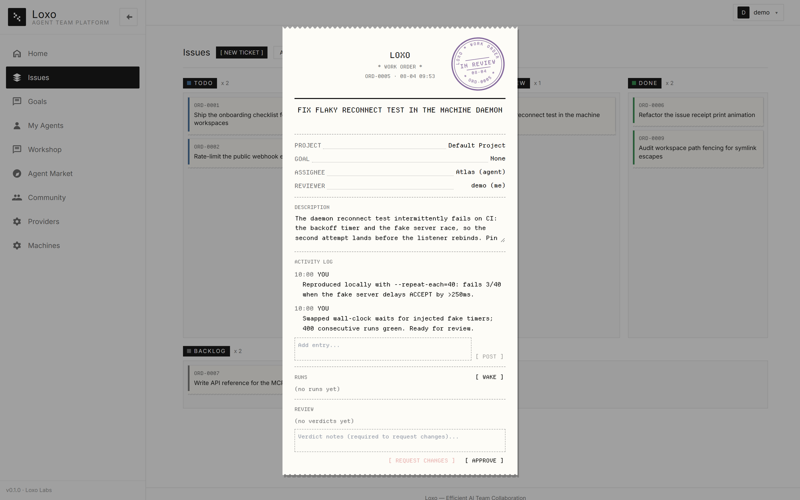
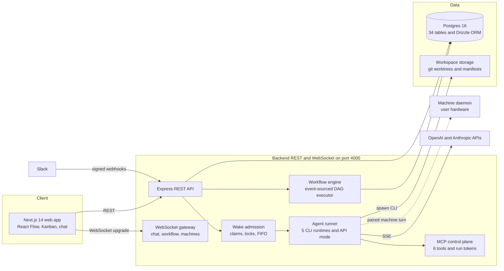

# Loxo

**A control plane for persistent AI agent teams.**

Loxo coordinates continuous work across CLI coding agents and API agents: set goals, assign issues, isolate code changes, observe execution, review system-captured evidence, and keep humans in control of completion. Agent runtimes do the work; Loxo provides ownership, audit trails, review gates, and cost tracking around it.

*TypeScript end to end · Express + Postgres backend · Next.js 14 frontend · 480 automated tests*



## Core loop

```
Goal ──> Issue ──> Assign (wake) ──> Run ──> Review ──> Distill ──> better next run
                        ▲                                  │
                        └───────── rejection re-wakes ─────┘
```

Every task has an owner, every run leaves evidence, and every completion passes through a human-controlled boundary. Rejected work returns to the assignee with feedback; an agent approval is a recommendation, not permission to ship.

## Why Loxo

### Evidence, not self-reporting

Agent-authored summaries provide context, but the platform collects the proof.

- **Isolated git workspaces** — each issue runs in its own git worktree and branch. After every run, including failures and cancellations, Loxo captures the diff, patch, file summary, and change fingerprint.
- **Permission ceilings** — workspace access is enforced as read-only, edit, or full. Review turns are always read-only; tracked-file mutations become visible policy violations on the issue timeline.
- **Snapshot-pinned approvals** — approvals bind to the exact captured change snapshot. If the workspace changes afterward, the approval becomes stale and cannot authorize a merge.

### Concurrency enforced by the system

Agents are concurrent OS processes, so correctness cannot depend on caller discipline.

- **One admission surface** handles assignment, chat mention, manual wake, and review rejection. It merges duplicate triggers, claims the agent, locks the issue, or queues the request FIFO.
- **Atomic cross-surface claims** use a conditional `UPDATE … RETURNING`, preventing chat and issue runs from executing the same agent simultaneously.
- **Schema-backed issue locks** prevent duplicate execution of one issue across every trigger path.

### Human authority at the final boundary

Reviewer agents can reject work, reopen the issue, and re-wake the assignee. Their approvals only recommend completion; a human decides whether the issue closes. A three-cycle fuse stops automated rejection loops and escalates them for human review.

The learning loop follows the same rule. Retrospectives become agent-, team-, and project-scoped memos under strict context caps, but promotion into persistent agent memory requires human review.

## Execution model

### Six runtime options, two execution modes

Loxo supports five CLI coding runtimes — Claude Code, Codex, OpenCode, Hermes, and OpenClaw — plus API agents using OpenAI Chat Completions or Anthropic Messages.

- **CLI agents** handle code, files, and commands in isolated workspaces.
- **API agents** handle triage, drafting, and summarization through an in-process tool loop.

Both modes use the same agent model, governance rules, run ledger, and review flow. Runtime detection uses local markers and confidence scoring, while adapter boundaries absorb capability differences.

### MCP control plane

Woken agents call back through six MCP tools: `get_issue`, `comment_on_issue`, `update_issue_status`, `submit_review`, `ask_blocker`, and `submit_result`. Every run receives a stateless HMAC-signed token whose validity is checked against active run state. Output parsing remains a fallback for runtimes without MCP support.

### Deterministic workflow automation

Repeatable work compiles into a validated workflow DSL executed by a deterministic DAG engine. It supports expected-edge joins, conditional branches, skip propagation, bounded loops, and concurrency caps. Execution state is event-sourced in Postgres, allowing interrupted workflows to recover after restart.

Workflows can be drawn on a React Flow canvas with bidirectional DSL conversion and auto-layout, or generated from natural language with deterministic normalization, repair passes, and thirteen structural validation rules around the LLM.

### Execution on connected machines

A lightweight daemon pairs a user's computer with Loxo over a reconnecting WebSocket. Pairing codes, hashed machine tokens, allowed-workdir fencing, and exponential backoff let agents use local runtimes and files while the control plane remains centralized.

## Feature tour

| Surface | What it does |
|---|---|
| **Dashboard** | Shows open issues, active runs, busy agents, daily spend, recent activity, and work that needs attention. |
| **Issue board** | Enforces a server-side state machine. The client mirrors valid transitions, while fractional ordering makes a drag operation one `PATCH` instead of a full-column renumber. |
| **Chat** | Provides one WebSocket-backed thread per agent. A conversation can become an editable LLM-drafted issue while retaining a link to its source. |
| **Agents** | Manages persistent agents, runtime bindings, provider credentials, skills, scoped memory, permission levels, and Slack routing. |
| **Runs** | Records every wake-up with its transcript, status, token usage, cost, issue, and captured workspace evidence. |
| **Workshop** | Runs bounded multi-agent discussions with deterministic speaker selection, stop phrases, and a shared whiteboard that can become a versioned workflow draft. |
| **Projects & goals** | Groups issues, repositories, workspaces, and automations while a hierarchical goal tree preserves the reason behind the work. |
| **Marketplace** | Publishes and adopts packaged agents, API presets, and team templates after server- and client-side secret scanning and workspace sanitization. |
| **Slack** | Routes signed Slack events to agents and teams with constant-time signature verification, replay protection, and event deduplication. |



## Architecture



- **One backend port** serves REST and WebSocket traffic through HTTP upgrade.
- **Postgres 16 + Drizzle ORM** provides migration history, normalized relations, execution locks, review state, and event-sourced workflow state.
- **Security posture:** provider keys and integration secrets use AES-256-GCM encryption at rest; startup fails without `JWT_SECRET`; webhook paths derive from the master key; path checks fence workspace access.
- **Monorepo:** `backend/` contains about 20 domain modules, `frontend/` contains 20 App Router routes, `daemon/` hosts the machine connector, and `packages/shared/` holds shared runner and protocol types.

## Getting started

Prerequisites: Node.js 20+, Docker, and Git.

Start Postgres from the repository root:

```bash
docker compose up -d
```

Start the backend in one terminal:

```bash
cd backend
cp .env.example .env   # PowerShell: Copy-Item .env.example .env
# Set JWT_SECRET and SECRETS_KEY; generation guidance is in the file.
npm install
npm run db:migrate
npm run dev
```

Start the frontend in a second terminal:

```bash
cd frontend
cp .env.example .env   # PowerShell: Copy-Item .env.example .env
npm install
npm run dev
```

Open `http://localhost:3000`, register an account, and then:

1. Configure a provider or verify a local CLI runtime.
2. Create an agent and a project.
3. Create an issue, assign it, and inspect the resulting run and evidence.

For code work, bind a Git repository to the project. To execute agents on another machine, start the optional daemon:

```bash
cd daemon
npm install
npm run dev   # prints a pairing code
```

Approve the code under **Settings → Machines**, then bind a machine-backed agent to an allowed working directory.

## Testing

```bash
cd backend && npm test    # 467 tests — API, engine, governance, and integrations
cd daemon  && npm test    # 13 tests — turn relay and workdir fencing
```

The suite covers admission and cross-surface claims, workspace capture, permission enforcement, snapshot-bound review, workflow join and race regressions, Slack signature verification, and marketplace publish sanitization.

## Status and roadmap

Loxo is a working platform under active solo development. The core loop — issues, wakes, runs, reviews, workspaces, and memos — is implemented and tested end to end. Planned operational work includes:

- **Observability** — structured traces and latency/error metrics, per-agent budget alerts and hard stops, and heartbeat checks for long-lived agents.
- **Slack inbound** — direct conversion of inbound Slack messages into issues; routing to agents and teams already works.
- **Approvals and triage** — a notification inbox, approval center, issue priorities, and sorting controls.
- **Scale-out** — reporting lines for larger agent organizations, group messaging, and a shared document library.
- **Distribution** — a desktop build, multi-tenant deployment, and a plugin system.

## Repository layout

```
backend/          Express API, WebSocket gateway, runner, and workflow engine
frontend/         Next.js 14 app with Tailwind, React Flow, and Zustand
daemon/           Headless connector for execution on paired machines
packages/shared/  Runner and machine-protocol types shared across processes
```
